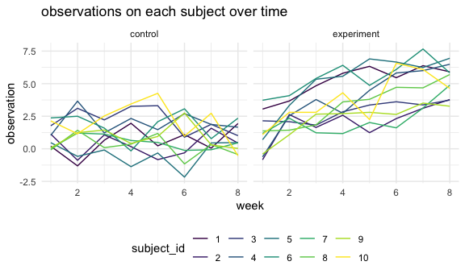

p8105_hw5_jl6648
================
Jixin Li
2023-11-07

``` r
library(tidyverse)
library(patchwork)

knitr::opts_chunk$set(
  fig.width = 6,
  fig.asp = .6,
  out.width = "95%"
)

theme_set(theme_minimal() + theme(legend.position = 'bottom'))

options(
  ggplot2.continuous.colour = 'viridis',
  ggplot2.continuous.fill = 'viridis'
)

scale_colour_discrete = scale_colour_viridis_d
scale_fill_discrete = scale_fill_viridis_d
```

# problem 1

# problem 2

## Start with a dataframe containing all file names

``` r
files_df <- tibble(
  files = list.files("data")) |>
  mutate(files = str_c("data", files, sep = "/"))
```

## Iterate over file names and read in data for each subject and tidy the result

``` r
study_df <- files_df |>
  mutate(respondents = map(files, read_csv)) |>
  mutate(arm_type = case_when(str_detect(files, "exp") ~ "experiment",
                               str_detect(files, "con") ~ "control"),
          subject_id = as.factor(parse_number(files))) |>
  unnest(respondents) |>
  pivot_longer(week_1:week_8, 
               names_to = "week", 
               values_to = "observations") |>
  mutate(week = as.numeric(parse_number(week)))
```

## Make a spaghetti plot showing observations on each subject over time

``` r
study_df |>
  ggplot(aes(x = week, y = observations, color = subject_id)) +
  geom_line() +
  facet_grid(. ~ arm_type) +
  labs(
    title = "observations on each subject over time",
    x = "week",
    y = "observation",
  )
```



the trend of observations between control and experimental group is
different. In the control group, the observation of each subject
fluctuate during 8 weeks, but finally back to the observation level of
week 1 and there no specific trend occur during 8 weeks. In the
experimental group, there is a increase trend of observation on each
subject during 8 weeks. At the end of week 8, the observation of each
subject is much higher than the observation of week 1.
