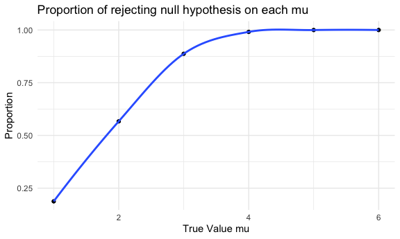
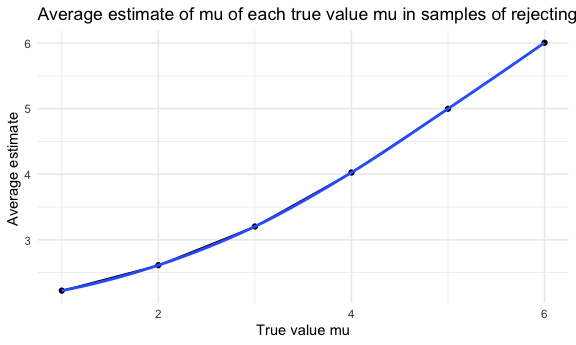

p8105_hw5_jl6648
================
Jixin Li
2023-11-07

``` r
library(tidyverse)
library(patchwork)

knitr::opts_chunk$set(
  fig.width = 6,
  fig.asp = .6,
  out.width = "95%"
)

theme_set(theme_minimal() + theme(legend.position = 'bottom'))

options(
  ggplot2.continuous.colour = 'viridis',
  ggplot2.continuous.fill = 'viridis'
)

scale_colour_discrete = scale_colour_viridis_d
scale_fill_discrete = scale_fill_viridis_d
```

# problem 1

# problem 2

## Start with a dataframe containing all file names

``` r
files_df <- tibble(
  files = list.files("data")) |>
  mutate(files = str_c("data", files, sep = "/"))
```

## Iterate over file names and read in data for each subject and tidy the result

``` r
study_df <- files_df |>
  mutate(respondents = map(files, read_csv)) |>
  mutate(arm_type = case_when(str_detect(files, "exp") ~ "experiment",
                               str_detect(files, "con") ~ "control"),
          subject_id = as.factor(parse_number(files))) |>
  unnest(respondents) |>
  pivot_longer(week_1:week_8, 
               names_to = "week", 
               values_to = "observations") |>
  mutate(week = as.numeric(parse_number(week)))
```

## Make a spaghetti plot showing observations on each subject over time

``` r
study_df |>
  ggplot(aes(x = week, y = observations, color = subject_id)) +
  geom_line() +
  facet_grid(. ~ arm_type) +
  labs(
    title = "observations on each subject over time",
    x = "week",
    y = "observation",
  )
```


the trend of observations between control and experimental group is
different. In the control group, the observation of each subject
fluctuate during 8 weeks, but finally back to the observation level of
week 1 and there no specific trend occur during 8 weeks. In the
experimental group, there is a increase trend of observation on each
subject during 8 weeks. At the end of week 8, the observation of each
subject is much higher than the observation of week 1.

# problem 3

## conduct a function and hypothesis test

``` r
set.seed(327)

sim_normal <- function(n = 30, mu, sigma = 5){
  x = rnorm(n, mean = mu, sd = sigma)
  test <- t.test(x = x, alternative = "two.sided", conf.level = 0.95) |>
    broom::tidy() |>
    select(estimate, p.value)
}
```

## Set μ=0 and generate 5000 datasets from the model

``` r
sim_mu_0 <- rerun(5000, sim_normal(mu = 0)) |>
  bind_rows()
```

    ## Warning: `rerun()` was deprecated in purrr 1.0.0.
    ## ℹ Please use `map()` instead.
    ##   # Previously
    ##   rerun(5000, sim_normal(mu = 0))
    ## 
    ##   # Now
    ##   map(1:5000, ~ sim_normal(mu = 0))
    ## This warning is displayed once every 8 hours.
    ## Call `lifecycle::last_lifecycle_warnings()` to see where this warning was
    ## generated.

## Repeat the above for μ={1,2,3,4,5,6}

``` r
sim_mu = 
  tibble(
    mu = c(1, 2, 3, 4, 5, 6)
    ) |>
  mutate(outputs = map(.x = mu, ~ rerun(5000, sim_normal(30, mu = .x))),
         estimate = map(outputs, bind_rows)) |>
  unnest(estimate) |>
  select(-outputs)
```

    ## Warning: There was 1 warning in `mutate()`.
    ## ℹ In argument: `outputs = map(.x = mu, ~rerun(5000, sim_normal(30, mu = .x)))`.
    ## Caused by warning:
    ## ! `rerun()` was deprecated in purrr 1.0.0.
    ## ℹ Please use `map()` instead.
    ##   # Previously
    ##   rerun(5000, sim_normal(30, mu = .x))
    ## 
    ##   # Now
    ##   map(1:5000, ~ sim_normal(30, mu = .x))

## Make a plot showing the proportion of times the null was rejected on the y axis and the true value of μ on the x axis

``` r
  sim_mu |>
  group_by(mu) |>
  summarize(p_value = sum(p.value < 0.05), 
            number = n(), 
            reject_prop = p_value/number) |>
  ggplot(aes(x = mu, y = reject_prop)) + 
  geom_point() + 
  geom_smooth() +
  labs(
    title = "Proportion of rejecting null hypothesis on each mu",
    x = "True Value mu", 
    y = "Proportion"
  )
```

    ## `geom_smooth()` using method = 'loess' and formula = 'y ~ x'

    ## Warning in max(ids, na.rm = TRUE): no non-missing arguments to max; returning
    ## -Inf



As mu increase from 1 to 6, the proportion of rejection null hypothesis
increases. There is a positive correlation between power and effect
size.

## Make a plot showing the average estimate of μ̂ on the y axis and the true value of μ on the x axis.

``` r
sim_mu |>
  group_by(mu) |>
  summarize(ave_estimate = mean(estimate)) |>
  ggplot(aes(x = mu, y = ave_estimate)) + 
  geom_point() +
  geom_line() + 
  geom_smooth() +
  labs(
    title = "Average estimate of mu of each true value mu",
    x = "True value mu", 
    y = "Average estimate "
  )
```

    ## `geom_smooth()` using method = 'loess' and formula = 'y ~ x'

    ## Warning in max(ids, na.rm = TRUE): no non-missing arguments to max; returning
    ## -Inf


## Make a plot showing the average estimate of μ̂ only in samples for which the null was rejected on the y axis and the true value of μ on the x axis.

``` r
sim_mu |>
  group_by(mu) |>
  filter(p.value < 0.05) |>
  summarize(ave_estimate = mean(estimate)) |>
  ggplot(aes(x = mu, y = ave_estimate)) + 
  geom_point() +
  geom_line() + 
  geom_smooth() +
  labs(
    title = "Average estimate of mu of each true value mu in samples of rejecting the null",
    x = "True value mu", 
    y = "Average estimate "
  )
```

    ## `geom_smooth()` using method = 'loess' and formula = 'y ~ x'

    ## Warning in max(ids, na.rm = TRUE): no non-missing arguments to max; returning
    ## -Inf



according to these two plots, as the true value mu increase, the sample
average of μ̂ across tests for which the null is rejected is more likely
to equal to the average estimate for true value of μ. From the plots, we
can tell at the mu equal to 4, 5, 6, both plots have the same average
estimate; however, at the mu equal to 1, 2, 3, the average estimate for
rejecting null hypothesis samples is slightly higher than the average
estimate for all samples. This is because there is variability in sample
estimates, and even when the null hypothesis is rejected, there can be
some estimation error.
