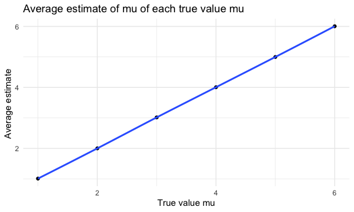
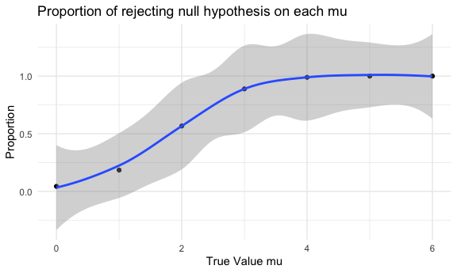
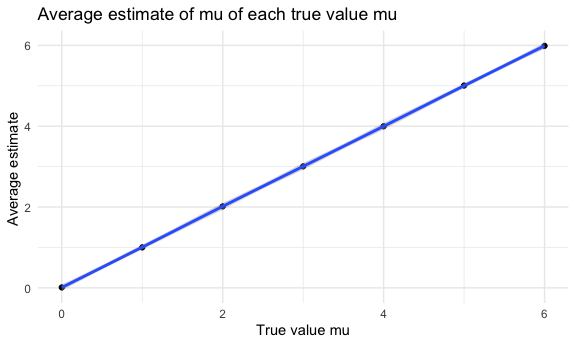
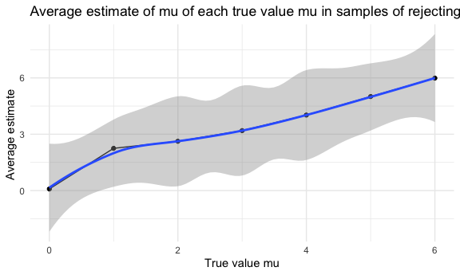

p8105_hw5_jl6648
================
Jixin Li
2023-11-07

``` r
library(tidyverse)
library(patchwork)
library(p8105.datasets)
library(viridis)

knitr::opts_chunk$set(
  fig.width = 6,
  fig.asp = .6,
  out.width = "95%"
)

theme_set(theme_minimal() + theme(legend.position = 'bottom'))

options(
  ggplot2.continuous.colour = 'viridis',
  ggplot2.continuous.fill = 'viridis'
)

scale_colour_discrete = scale_colour_viridis_d
scale_fill_discrete = scale_fill_viridis_d
```

# problem 1

For this problem, we are interested in data gathered and made public by
*The Washington Post* on homicides in 50 large U.S. cities. The code
chunk below imports and cleans the data.

``` r
homicide_df = 
  read_csv("homicide-data.csv", na = c("", "NA", "Unknown")) %>%
  mutate(
    city_state = str_c(city, state, sep = ", "),
    resolution = case_when(
      disposition == "Closed without arrest" ~ "unsolved",
      disposition == "Open/No arrest"        ~ "unsolved",
      disposition == "Closed by arrest"      ~ "solved"
    )
  ) %>% 
  filter(city_state != "Tulsa, AL") 
```

    ## Rows: 52179 Columns: 12
    ## ── Column specification ────────────────────────────────────────────────────────
    ## Delimiter: ","
    ## chr (8): uid, victim_last, victim_first, victim_race, victim_sex, city, stat...
    ## dbl (4): reported_date, victim_age, lat, lon
    ## 
    ## ℹ Use `spec()` to retrieve the full column specification for this data.
    ## ℹ Specify the column types or set `show_col_types = FALSE` to quiet this message.

The resulting dataframe has 52178 entries, on variables that include the
victim name, race, age, and sex; the date the homicide was reported; and
the location of the homicide. In cleaning, I created a `city_state`
variable that includes both city and state, and a `resolution` variable
to indicate whether the case was closed by arrest. I also excluded one
entry in Tulsa, AL, which is not a major US city and is most likely a
data entry error.

In the next code chunk, I group within cities and summarize to produce
the total number of homicides and the number that are solved.

``` r
city_homicide_df = 
  homicide_df %>% 
  select(city_state, disposition, resolution) %>% 
  group_by(city_state) %>% 
  summarize(
    hom_total = n(),
    hom_unsolved = sum(resolution == "unsolved"))
```

Focusing only on Baltimore, MD, I can use the `prop.test` and
`broom::tidy` functions to obtain an estimate and CI of the proportion
of unsolved homicides in that city. The table below shows those values.

``` r
bmore_test = 
  prop.test(
    x = filter(city_homicide_df, city_state == "Baltimore, MD") %>% pull(hom_unsolved),
    n = filter(city_homicide_df, city_state == "Baltimore, MD") %>% pull(hom_total)) 

broom::tidy(bmore_test) %>% 
  knitr::kable(digits = 3)
```

| estimate | statistic | p.value | parameter | conf.low | conf.high | method                                               | alternative |
|---------:|----------:|--------:|----------:|---------:|----------:|:-----------------------------------------------------|:------------|
|    0.646 |   239.011 |       0 |         1 |    0.628 |     0.663 | 1-sample proportions test with continuity correction | two.sided   |

Building on this code, I can use functions in the `purrr` package to
obtain estimates and CIs for the proportion of unsolved homicides in
each city in my dataset. The code below implements this analysis.

``` r
test_results = 
  city_homicide_df %>% 
  mutate(
    prop_tests = map2(hom_unsolved, hom_total, \(x, y) prop.test(x = x, n = y)),
    tidy_tests = map(prop_tests, broom::tidy)) %>% 
  select(-prop_tests) %>% 
  unnest(tidy_tests) %>% 
  select(city_state, estimate, conf.low, conf.high) %>% 
  mutate(city_state = fct_reorder(city_state, estimate))
```

Finally, I make a plot showing the estimate (and CI) of the proportion
of unsolved homicides in each city.

``` r
test_results %>% 
  mutate(city_state = fct_reorder(city_state, estimate)) %>% 
  ggplot(aes(x = city_state, y = estimate)) + 
  geom_point() + 
  geom_errorbar(aes(ymin = conf.low, ymax = conf.high)) + 
  theme(axis.text.x = element_text(angle = 90, hjust = 1))
```


This figure suggests a very wide range in the rate at which homicides
are solved – Chicago is noticeably high and, given the narrowness of the
CI, likely is the location of many homicides.

# problem 2

## Start with a dataframe containing all file names

``` r
files_df <- tibble(
  files = list.files("data")) |>
  mutate(files = str_c("data", files, sep = "/"))
```

## Iterate over file names and read in data for each subject and tidy the result

``` r
study_df <- files_df |>
  mutate(respondents = map(files, read_csv)) |>
  mutate(arm_type = case_when(str_detect(files, "exp") ~ "experiment",
                               str_detect(files, "con") ~ "control"),
          subject_id = as.factor(parse_number(files))) |>
  unnest(respondents) |>
  pivot_longer(week_1:week_8, 
               names_to = "week", 
               values_to = "observations") |>
  mutate(week = as.numeric(parse_number(week)))
```

## Make a spaghetti plot showing observations on each subject over time

``` r
study_df |>
  ggplot(aes(x = week, y = observations, color = subject_id)) +
  geom_line() +
  facet_grid(. ~ arm_type) +
  labs(
    title = "observations on each subject over time",
    x = "week",
    y = "observation",
  )
```



the trend of observations between control and experimental group is
different. In the control group, the observation of each subject
fluctuate during 8 weeks, but finally back to the observation level of
week 1 and there no specific trend occur during 8 weeks. In the
experimental group, there is a increase trend of observation on each
subject during 8 weeks. At the end of week 8, the observation of each
subject is much higher than the observation of week 1.

# problem 3

## conduct a function and hypothesis test

``` r
set.seed(327)

sim_normal <- function(n = 30, mu, sigma = 5){
  x = rnorm(n, mean = mu, sd = sigma)
  test <- t.test(x = x, alternative = "two.sided", conf.level = 0.95) |>
    broom::tidy() |>
    select(estimate, p.value)
}
```

## Set μ=0 and generate 5000 datasets from the model

``` r
sim_mu_0 <- rerun(5000, sim_normal(mu = 0)) |>
  bind_rows()
```

    ## Warning: `rerun()` was deprecated in purrr 1.0.0.
    ## ℹ Please use `map()` instead.
    ##   # Previously
    ##   rerun(5000, sim_normal(mu = 0))
    ## 
    ##   # Now
    ##   map(1:5000, ~ sim_normal(mu = 0))
    ## This warning is displayed once every 8 hours.
    ## Call `lifecycle::last_lifecycle_warnings()` to see where this warning was
    ## generated.

## Repeat the above for μ={1,2,3,4,5,6}

``` r
sim_mu = 
  tibble(
    mu = c(0, 1, 2, 3, 4, 5, 6)
    ) |>
  mutate(outputs = map(.x = mu, ~ rerun(5000, sim_normal(30, mu = .x))),
         estimate = map(outputs, bind_rows)) |>
  unnest(estimate) |>
  select(-outputs)
```

    ## Warning: There was 1 warning in `mutate()`.
    ## ℹ In argument: `outputs = map(.x = mu, ~rerun(5000, sim_normal(30, mu = .x)))`.
    ## Caused by warning:
    ## ! `rerun()` was deprecated in purrr 1.0.0.
    ## ℹ Please use `map()` instead.
    ##   # Previously
    ##   rerun(5000, sim_normal(30, mu = .x))
    ## 
    ##   # Now
    ##   map(1:5000, ~ sim_normal(30, mu = .x))

## Make a plot showing the proportion of times the null was rejected on the y axis and the true value of μ on the x axis

``` r
  sim_mu |>
  group_by(mu) |>
  summarize(p_value = sum(p.value < 0.05), 
            number = n(), 
            reject_prop = p_value/number) |>
  ggplot(aes(x = mu, y = reject_prop)) + 
  geom_point() + 
  geom_smooth() +
  labs(
    title = "Proportion of rejecting null hypothesis on each mu",
    x = "True Value mu", 
    y = "Proportion"
  )
```

    ## `geom_smooth()` using method = 'loess' and formula = 'y ~ x'



As mu increase from 0 to 6, the proportion of rejection null hypothesis
increases. There is a positive correlation between power and effect
size.

## Make a plot showing the average estimate of μ̂ on the y axis and the true value of μ on the x axis.

``` r
sim_mu |>
  group_by(mu) |>
  summarize(ave_estimate = mean(estimate)) |>
  ggplot(aes(x = mu, y = ave_estimate)) + 
  geom_point() +
  geom_line() + 
  geom_smooth() +
  labs(
    title = "Average estimate of mu of each true value mu",
    x = "True value mu", 
    y = "Average estimate "
  )
```

    ## `geom_smooth()` using method = 'loess' and formula = 'y ~ x'



## Make a plot showing the average estimate of μ̂ only in samples for which the null was rejected on the y axis and the true value of μ on the x axis.

``` r
sim_mu |>
  group_by(mu) |>
  filter(p.value < 0.05) |>
  summarize(ave_estimate = mean(estimate)) |>
  ggplot(aes(x = mu, y = ave_estimate)) + 
  geom_point() +
  geom_line() + 
  geom_smooth() +
  labs(
    title = "Average estimate of mu of each true value mu in samples of rejecting the null",
    x = "True value mu", 
    y = "Average estimate "
  )
```

    ## `geom_smooth()` using method = 'loess' and formula = 'y ~ x'



according to these two plots, as the true value mu increase, the sample
average of μ̂ across tests for which the null is rejected is more likely
to equal to the average estimate for true value of μ. From the plots, we
can tell at the mu equal to 4, 5, 6, both plots have the same average
estimate; however, at the mu equal to 0, 1, 2, 3, the average estimate
for rejecting null hypothesis samples is slightly higher than the
average estimate for all samples. This is because there is variability
in sample estimates, and even when the null hypothesis is rejected,
there can be some estimation error.
